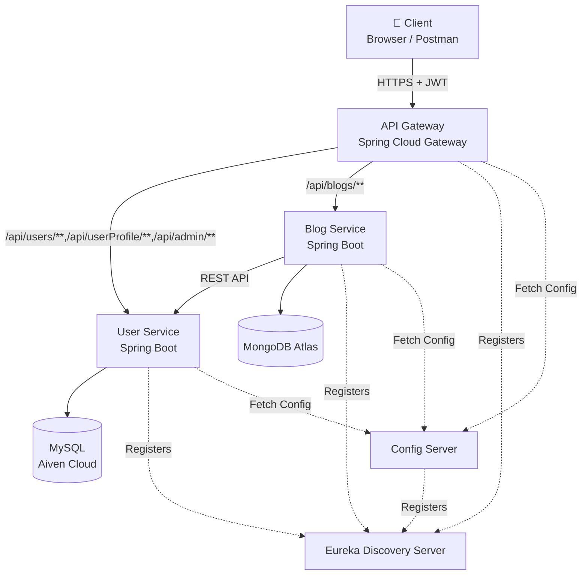
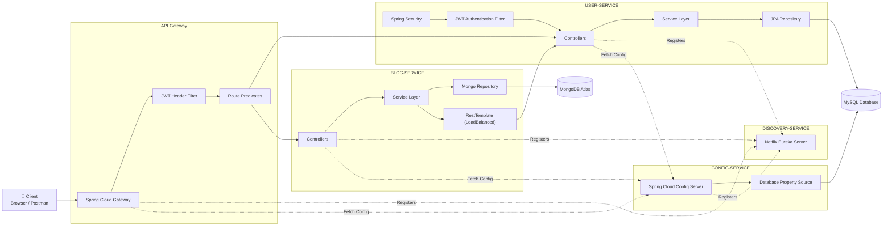
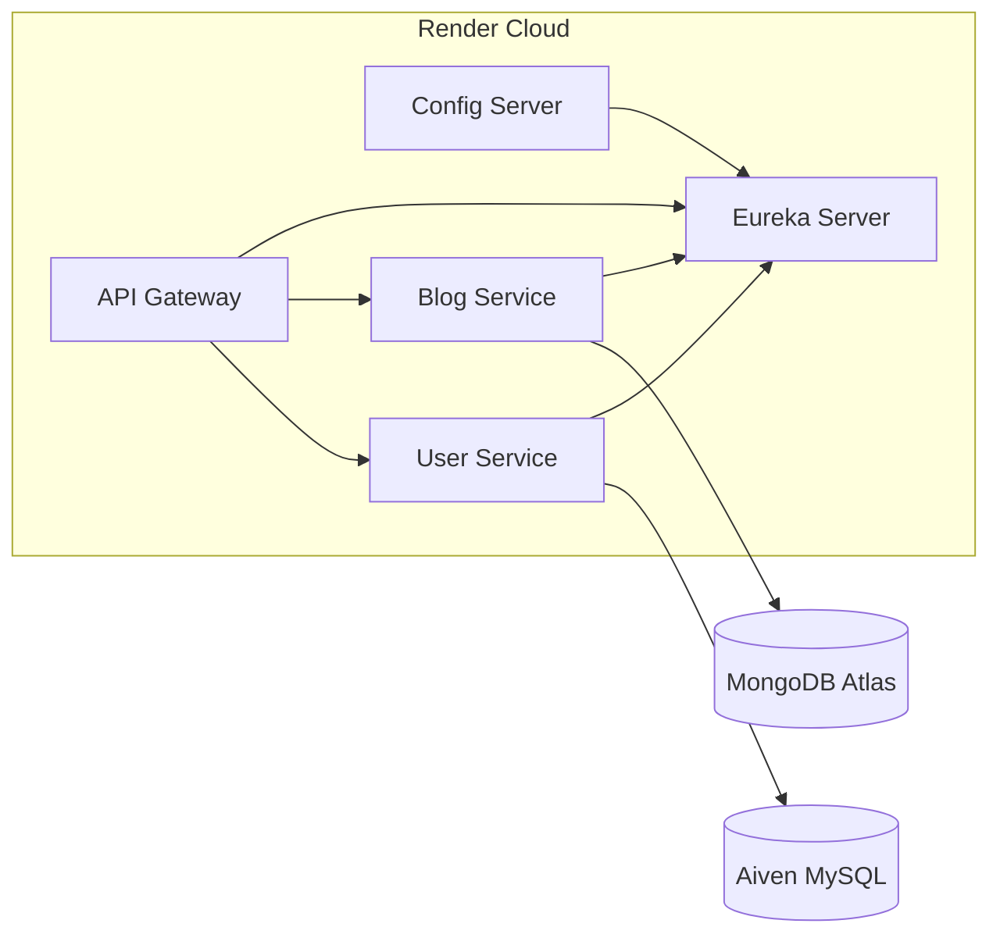
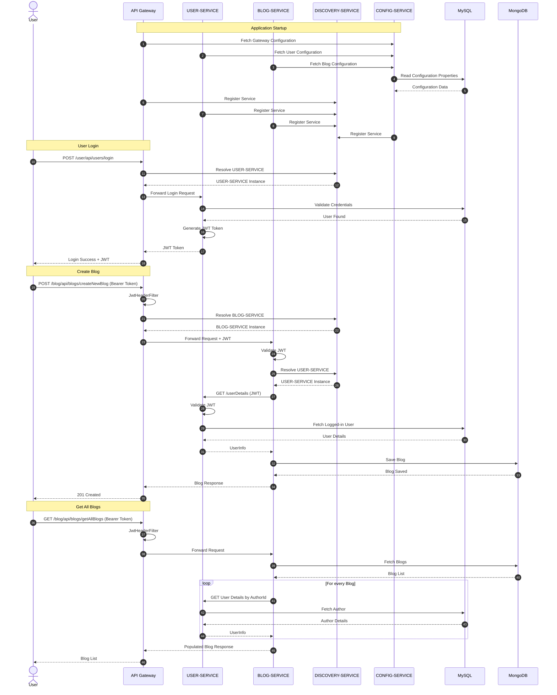
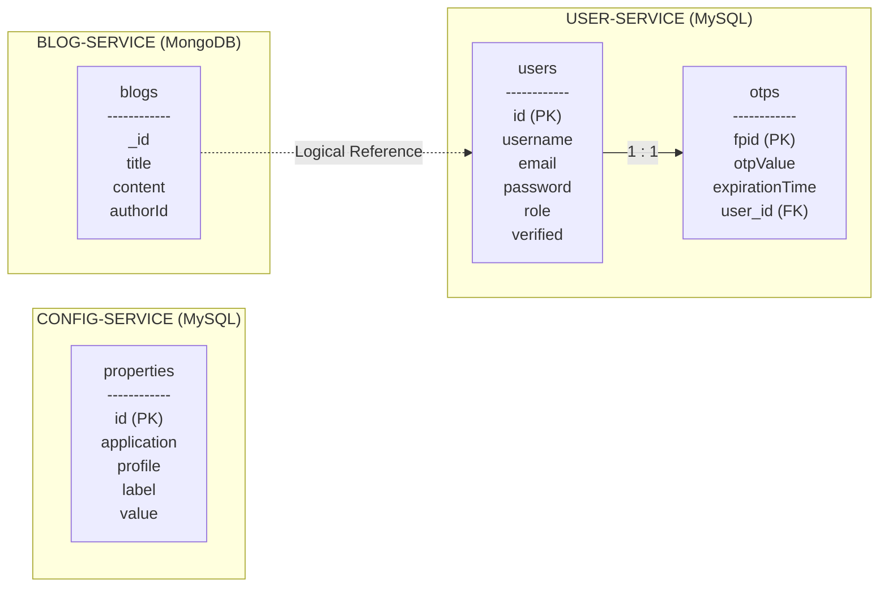

# Blogging Platform REST APIs Using Spring Microservices
  RESTful API for Users that allows them to register/login in this and then to post, read, edit, and delete their blogs.

## Features:
 * RESTful API with endpoints for creating, reading, updating, and deleting blogs. 
 * Each user detail have atleast an email(username), password, role.
 * User can register as either of the 2 roles available: USER, ADMIN.
 * Admin User can make change other user roles to Admin/User, can delete a user including cascade delete of his/her blogs, can get all users info.
 * User can get blog to read by blog id, can get all blogs to read, can post new blogs, can update, delete their created blogs.
 * Made use of Netflix Eureka Discovery Service for registering microservices: API-GATEWAY, CONFIG-SERVICE, USER-SERVICE, BLOG-SERVICE.
 * Fetching application.properties for CONFIG-SERVICE, USER-SERVICE, BLOG-SERVICE from SQL DB, properties table.
 * USER-SERVICE stores users info in SQL DB, users table.
 * BLOG-SERVICE stores blogs info in NoSQL DB, blogs collection.
 * Each microservice running on different ports, other than discovery service all others microservices could be visible in eureka service registry when they're up and running.
 * Each microservice is packaged as a Docker container and deployed on Render Cloud.
 * Provided clear and comprehensive API documentation using tools like Swagger or OpenAPI.

## High Level Design (HLD):

## Low Level Design (LLD):

## Deployment Diagram:

## Sequence Diagram:

## Database Schema (ER Diagram):

## Tech Stack Used:

#### Back-End:
    

#### Database:

#### Deployed Version: 
https://springblogmicroservicediscovery-latest.onrender.com/

## Demonstration:

